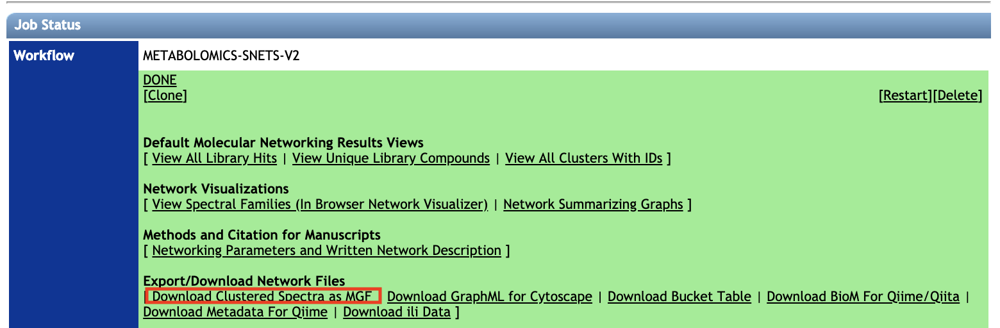
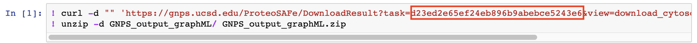
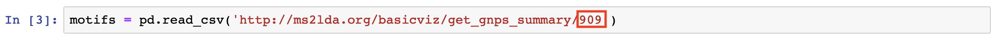
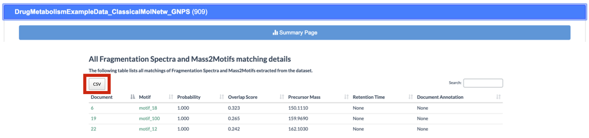
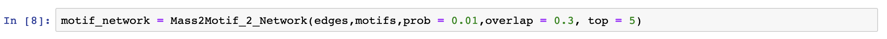
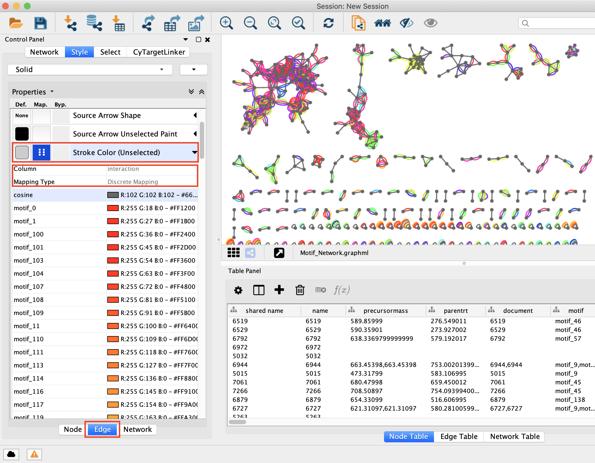
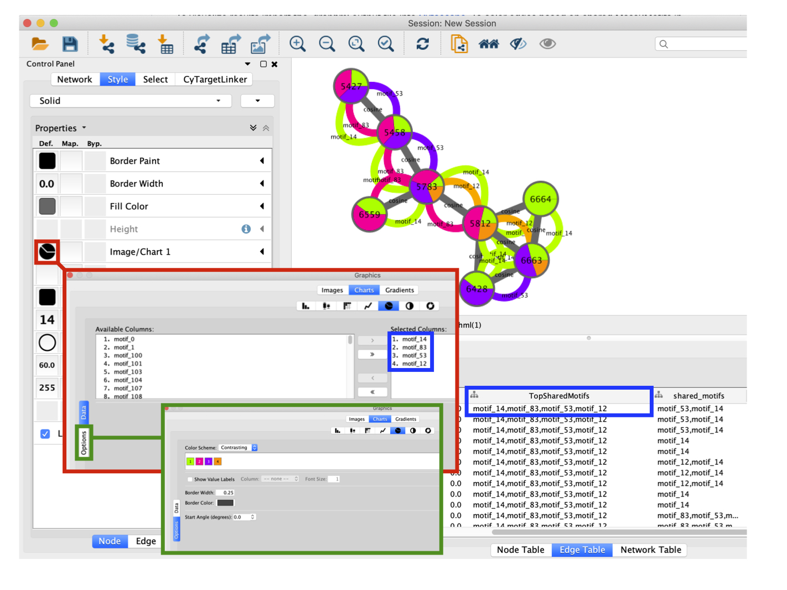
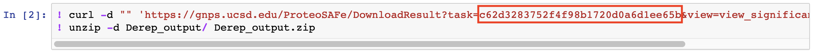
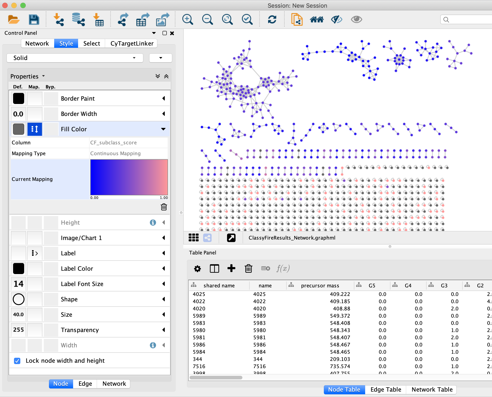

# pyMolNetEnhancer

pyMolNetEnhancer is a python module integrating chemical class and substructure information within mass spectral molecular networks created through the [Global Natural Products Social Molecular Networking (GNPS)](https://gnps.ucsd.edu/) platform.

### Table of contents

* [Installation](#installation)
* [Map MS2LDA substructural information to mass spectral molecular networks (classical)](#Mass2Motifs_to_Network_Classical)
* [Map MS2LDA substructural information to mass spectral molecular networks (feature based)](#Mass2Motifs_to_Network_FeatureBased)
* [Map chemical class information to mass spectral molecular networks](#ChemicalClasses_to_Network)
* [Map chemical class and MS2LDA substructural information to mass spectral molecular networks](#ChemicalClasses_Motifs_to_Network)
* [Dependencies](#dependencies)
* [Main citation](#main_citation)
* [Other citations](#other_citations)
* [License](#licence)

## Installation

Install pyMolNetEnhancer with:

 `pip install pyMolNetEnhancer`
 
 
## Map MS2LDA substructural information to mass spectral molecular networks (classical) <a name="Mass2Motifs_to_Network_Classical"></a>
 
In order to map substructural information to a mass spectral molecular network you need to:
 
* [Create a molecular network](https://ccms-ucsd.github.io/GNPSDocumentation/quickstart/) through the Global Natural Products Social Molecular Networking (GNPS) platform
* Create an LDA experiment on [http://ms2lda.org/](http://ms2lda.org/) using the MGF clustered spectra downloaded from GNPS:



Then execute the code in [Example_notebooks/Mass2Motifs_2_Network_Classical.ipynb](https://github.com/madeleineernst/pyMolNetEnhancer/blob/master/Example_notebooks/Mass2Motifs_2_Network_Classical.ipynb) line by line.
The only things you need to specify are:

<ol>
  <li>Your GNPS job ID 
  </li>
  <li>Your MS2LDA job ID
  
  <b>Note</b>: Depending on the size of this file, a server connection timeout may occur. Alternatively, you may download the file manually at http://ms2lda.org/: <br>
  </li>
  <li>User-defined parameters for mapping the Mass2Motifs onto the network
  
  <tt>prob</tt>: minimal probability score for a Mass2Motif to be included. Default is 0.01. <br>
  <tt>overlap</tt>: minimal overlap score for a Mass2Motif to be included. Default is 0.3. <br>
  <b>Important</b>: The probability and overlap thresholds can be set within the ms2lda.org app as well under the Experimental Options tab. It is recommendable to do so when inspecting results in the web app. Importantly, the summary table contains filtered motif-document relations using the set thresholds in the web app. <br>
  <tt>top</tt>: This parameter specifies how many most shared motifs per molecular family (network component index) should be shown. Default is 5.
</li>
</ol>

To visualize results import the .graphml output file into [Cytoscape](https://cytoscape.org/). To color edges based on shared Mass2Motifs in between nodes select 'Stroke Color' in the 'Edge' tab to the left and choose 'interaction' as <i>Column</i> and 'Discrete Mapping' as <i>Mapping Type</i>:


To color nodes by the most shared Mass2Motifs per molecular family (network component index) select 'Image/Chart' in the 'Node' tab to the left and select Mass2Motifs shown in 'TopSharedMotifs' in the Edge Table:



## Map MS2LDA substructural information to mass spectral molecular networks (feature based) <a name="Mass2Motifs_to_Network_FeatureBased"></a>

In order to map substructural information to a mass spectral molecular network created through the feature based workflow you need to:

* [Create a feature based molecular network](https://ccms-ucsd.github.io/GNPSDocumentation/featurebasedmolecularnetworking/) through the Global Natural Products Social Molecular Networking (GNPS) platform
* Create an LDA experiment on [http://ms2lda.org/](http://ms2lda.org/) using the MGF file created within MZmine (see [GNPS documentation](https://ccms-ucsd.github.io/GNPSDocumentation/featurebasedmolecularnetworking/))

Then execute the code in [Example_notebooks/Mass2Motifs_2_Network_FeatureBased.ipynb](https://github.com/madeleineernst/pyMolNetEnhancer/blob/master/Example_notebooks/Mass2Motifs_2_Network_FeatureBased.ipynb) line by line.
The only things you need to specify are:

<ol>
  <li>Your GNPS job ID 
  </li>
  <li>Your MS2LDA job ID
  
  <b>Note</b>: Depending on the size of this file, a server connection timeout may occur. Alternatively, you may download the file manually at http://ms2lda.org/: <br>
  </li>
  <li>User-defined parameters for mapping the Mass2Motifs onto the network
  
  <tt>prob</tt>: minimal probability score for a Mass2Motif to be included. Default is 0.01. <br>
  <tt>overlap</tt>: minimal overlap score for a Mass2Motif to be included. Default is 0.3. <br>
  <b>Important</b>: The probability and overlap thresholds can be set within the ms2lda.org app as well under the Experimental Options tab. It is recommendable to do so when inspecting results in the web app. Importantly, the summary table contains filtered motif-document relations using the set thresholds in the web app. <br>
  <tt>top</tt>: This parameter specifies how many most shared motifs per molecular family (network component index) should be shown. Default is 5.
</li>
</ol>

To visualize results import the .graphml output file into [Cytoscape](https://cytoscape.org/). To color edges based on shared Mass2Motifs in between nodes select 'Stroke Color' in the 'Edge' tab to the left and choose 'interaction' as <i>Column</i> and 'Discrete Mapping' as <i>Mapping Type</i>:


To color nodes by the most shared Mass2Motifs per molecular family (network component index) select 'Image/Chart' in the 'Node' tab to the left and select Mass2Motifs shown in 'TopSharedMotifs' in the Edge Table:


## Map chemical class information to mass spectral molecular networks <a name="ChemicalClasses_to_Network"></a>

In order to map chemical class information to a mass spectral molecular network you need to:

* Create a molecular network using the [classical](https://ccms-ucsd.github.io/GNPSDocumentation/quickstart/) or [feature based](https://ccms-ucsd.github.io/GNPSDocumentation/featurebasedmolecularnetworking/) workflow through the Global Natural Products Social Molecular Networking (GNPS) platform
* Perform <i>in silico</i> structure annotation using [Network Annotation Propagation](https://ccms-ucsd.github.io/GNPSDocumentation/nap/) (NAP), [DEREPLICATOR](https://ccms-ucsd.github.io/GNPSDocumentation/dereplicator/) or another tool of preference for <i>in silico</i> structure annotation 

Then execute the code in [Example_notebooks/ChemicalClasses_2_Network.ipynb](https://github.com/madeleineernst/pyMolNetEnhancer/blob/master/Example_notebooks/ChemicalClasses_2_Network.ipynb) line by line.
The only things you need to specify are:

<ol>
  <li>Your GNPS job ID 
  </li>
  <li>Your DEREPLICATOR job ID(s)
  </li>
  <li>Your NAP job ID(s)
  
  </li>
</ol>

You can specify as many <i>in silico</i> annotation outputs as you wish. If you import results from applications different than NAP or DEREPLICATOR make sure that your input file is tab separated and includes a column named 'Scan' containing numeric identifiers matching the numeric node identifiers in the GNPS network and a column named 'SMILES' containing SMILES structures.
Make sure that you include all results as dataframe list items in the 'matches' object. The object 'gnpslib' contains all GNPS library hits:

 `matches = [gnpslib, nap, derep]`
 
In this notebook we use [ChemAxon's molconvert](https://docs.chemaxon.com/display/docs/Molconvert) to convert SMILES to InChIKeys. Make sure to have molconvert installed and add the path to the environment:
 
```
path = '/Applications/MarvinSuite/bin/'
os.environ['PATH'] += ':'+path
```

To visualize results import the .graphml output file into [Cytoscape](https://cytoscape.org/). To color nodes based on the chemical subclass select 'Fill Color' in the 'Node' tab to the left and choose 'CF_subclass' as <i>Column</i> and 'Discrete Mapping' as <i>Mapping Type</i>:


To color nodes based on the chemical subclass select 'Fill Color' in the 'Node' tab to the left and choose 'CF_subclass_score' as <i>Column</i> and 'Continuous Mapping' as <i>Mapping Type</i>:


All columns related to chemical class information are labeled with 'CF_', and chemical class information at other hierarchical levels of the chemical taxonomy can be mapped analogously (e.g. CF_superclass, CF_superclass_score, CF_class, etc.)

## Map chemical class and MS2LDA substructural information to mass spectral molecular networks <a name="ChemicalClasses_Motifs_to_Network"></a>

In order to map chemical class and MS2LDA substructural information to a mass spectral molecular network follow steps described for [mapping MS2LDA substructural information using the classical](#Mass2Motifs_to_Network_Classical) or
[feature based](#Mass2Motifs_to_Network_FeatureBased) workflow and [mapping chemical class information to mass spectral molecular networks](#ChemicalClasses_to_Network). To create a graphml file containing both Mass2Motif as well as chemical class information do:

```
graphML_classy = make_classyfire_graphml(MG,final)
nx.write_graphml(graphML_classy, "Motif_ChemicalClass_Network_Classical.graphml", infer_numeric_types = True)
```

where 'MG' corresponds to the Mass2Motif network and 'final' to the dataframe output created when mapping chemical class information. For an example see [Example_notebooks/Mass2Motifs_2_Network_Classical.ipynb](https://github.com/madeleineernst/pyMolNetEnhancer/blob/master/Example_notebooks/Mass2Motifs_2_Network_Classical.ipynb). To visualize the network in Cytoscape proceed as described in [mapping MS2LDA substructural information using the classical](#Mass2Motifs_to_Network_Classical) or
[feature based](#Mass2Motifs_to_Network_FeatureBased) workflow and [mapping chemical class information to mass spectral molecular networks](#ChemicalClasses_to_Network). 

## Dependencies

python 3.6.5, collections 0.6.1, csv 1.0, functools, joblib 0.13.0, json 2.0.9, multiprocessing, networkx 2.1, operator, os, pandas 0.22.0, rdkit, re 2.2.1, requests 2.18.4, sys, time

## Main citation <a name="main_citation"></a>
https://github.com/madeleineernst/pyMolNetEnhancer

## Other citations <a name="other_citations"></a>
MolNetEnhancer uses molecular networking through GNPS: <br>
Wang, M.; Carver, J. J.; Phelan, V. V.; Sanchez, L. M.; Garg, N.; Peng, Y.; Nguyen, D. D.; Watrous, J.; Kapono, C. A.; Luzzatto-Knaan, T.; et al. Sharing and Community Curation of Mass Spectrometry Data with Global Natural Products Social Molecular Networking. Nat. Biotechnol. 2016, 34 (8), 828–837.
https://www.nature.com/articles/nbt.3597

MolNetEnhancer uses untargeted substructure exploration through MS2LDA: <br>
van der Hooft, J.J.J.; Wandy, J.; Barrett, M.P.; Burgess, K.E.V.; Rogers, S. Topic modeling for untargeted substructure exploration in metabolomics. PNAS 2016, 113 (48), 13738-13743.
https://www.pnas.org/content/113/48/13738

MolNetEnhancer uses Network Annotation Propagation (NAP): <br>
da Silva, R. R.; Wang, M.; Nothias, L.-F.; van der Hooft, J. J. J.; Caraballo-Rodríguez, A. M.; Fox, E.; Balunas, M. J.; Klassen, J. L.; Lopes, N. P.; Dorrestein, P. C. Propagating Annotations of Molecular Networks Using in Silico Fragmentation. PLoS Comput. Biol. 2018, 14 (4), e1006089.
http://journals.plos.org/ploscompbiol/article?id=10.1371/journal.pcbi.1006089

MolNetEnhancer uses DEREPLICATOR: <br>
Mohimani, H.; Gurevich, A.; Mikheenko, A.; Garg, N.; Nothias, L.-F.; Ninomiya, A.; Takada, K.; Dorrestein, P.C.; Pevzner, P.A. Dereplication of peptidic natural products through database search of mass spectra. Nat. Chem. Biol. 2017, 13, 30-37.
https://www.nature.com/articles/nchembio.2219

MolNetEnhancer uses automated chemical classification through ClassyFire: <br>
Feunang, Y. D.; Eisner, R.; Knox, C.; Chepelev, L.; Hastings, J.; Owen, G.; Fahy, E.; Steinbeck, C.; Subramanian, S.; Bolton, E.; Greiner, R.; Wishart, D.S. ClassyFire: automated chemical classification with a comprehensive, computable taxonomy. J. Cheminform. 2016, 8, 61.
https://jcheminf.biomedcentral.com/articles/10.1186/s13321-016-0174-y

## Licence
This repository is available under the following licence https://github.com/madeleineernst/pyMolNetEnhancer/blob/master/LICENSE
